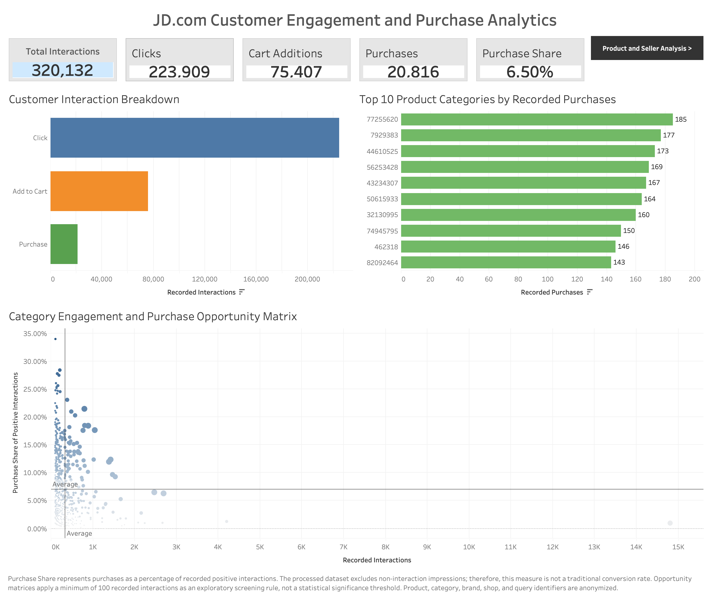
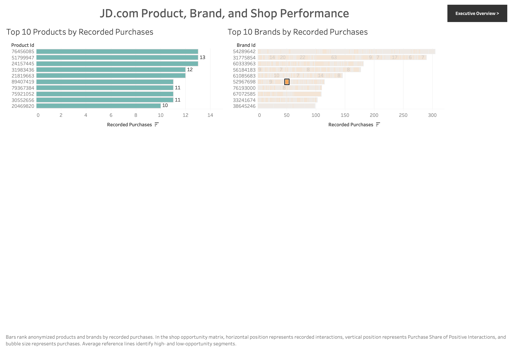

# From Search to Sale: JD.com Search & Shopping Behavior Analysis

### An end-to-end analysis of search and shopping behavior using Python, PostgreSQL, SQL, and Tableau

This portfolio project analyzes more than **320,000 recorded positive shopping interactions** from the JDsearch dataset to identify patterns in customer engagement and purchase activity across products, categories, brands, shops, and search queries.

The project demonstrates an end-to-end analytics workflow: data validation and preparation in Python, relational analysis in PostgreSQL/SQL, exploratory analysis, data-quality testing, Tableau dashboard development, and translation of analytical findings into stakeholder-focused business recommendations.

---

## Executive Summary

The analysis examined **320,132 recorded positive interactions**, consisting of:

| Interaction | Records | Share of Positive Interactions |
|---|---:|---:|
| Clicks | 223,909 | 69.94% |
| Add to Cart | 75,407 | 23.56% |
| Purchases | 20,816 | 6.50% |
| **Total** | **320,132** | **100%** |

Clicks represent the majority of recorded positive interactions, while purchases account for **6.50%**.

Because the dataset does not contain impressions, linked customer sessions, or complete customer journeys, this project does **not** interpret these interaction types as stages of a traditional conversion funnel.

Instead, the project uses **Purchase Share**:

> **Purchase Share = Purchases ÷ Recorded Positive Interactions**

This provides a consistent descriptive metric for comparing purchase activity across segments without overstating what the available data can demonstrate.

---

## Business Problem

Large e-commerce platforms generate enormous volumes of behavioral data, but interaction volume alone does not explain where purchasing activity is strongest or where further investigation may be valuable.

This project addresses the following question:

> **Where do patterns in recorded search and shopping interactions reveal opportunities to investigate customer engagement and product discovery?**

The analysis focuses on:

- Overall interaction composition
- Category performance
- Brand performance
- Shop performance
- Product performance
- Search-query performance
- High-engagement segments with comparatively low Purchase Share

The goal is not to claim causation, but to identify **evidence-based priorities for deeper investigation and testing**.

---

## Dataset

The processed analytical dataset contains:

- **320,132** recorded positive interactions
- **237,814** unique products
- **110,393** unique query records
- **47,757** brands
- **4,777** level-4 product categories
- **78,976** shop identifiers, including the unidentified-shop sentinel

The analyzed interaction labels are:

- `1` — Click
- `2` — Add to Cart
- `3` — Purchase

Records representing no positive interaction are outside the analytical population used in this project.

Additional information about the dataset, scope, and data-quality decisions is available in [`data/README.md`](data/README.md).

---

## Tools & Technologies

| Tool | Application |
|---|---|
| **Python** | Data cleaning, validation, exploratory analysis, aggregation, and sensitivity testing |
| **Pandas** | Data manipulation and analytical transformations |
| **Jupyter Notebook** | Reproducible Python analysis and documentation |
| **PostgreSQL** | Relational database environment |
| **SQL** | Category, brand, shop, product, query, and data-quality analysis |
| **pgAdmin** | PostgreSQL database administration and query execution |
| **Tableau** | Interactive dashboards and stakeholder-facing visualization |
| **PowerPoint** | Stakeholder presentation |
| **GitHub** | Project documentation and portfolio delivery |

---

## Analytical Workflow

The project followed a structured analytical process:

1. **Validate the source data**
   - Inspect structure and data types
   - Validate interaction labels
   - Check missing values
   - Identify duplicate records
   - Evaluate identifier consistency

2. **Prepare the analytical dataset**
   - Standardize column names
   - Create descriptive interaction labels
   - Create analytical indicator fields
   - Validate derived fields

3. **Perform exploratory analysis**
   - Measure interaction composition
   - Evaluate category, brand, shop, product, and query activity
   - Calculate Purchase Share
   - Identify high-volume segments for further investigation

4. **Build PostgreSQL analysis**
   - Create reusable analytical views
   - Validate aggregate results against the source table
   - Analyze performance across major business dimensions
   - Perform data-quality checks

5. **Develop Tableau dashboards**
   - Build executive-level KPIs
   - Visualize interaction composition
   - Compare product and seller performance
   - Surface segments warranting further investigation

6. **Translate findings into business recommendations**
   - Prioritize investigation based on evidence
   - Separate descriptive findings from causal conclusions
   - Identify additional data needed for deeper analysis

---

## Dashboard — Executive Overview



The Executive Overview provides a high-level view of interaction activity and Purchase Share, allowing stakeholders to quickly understand the scale and composition of the analyzed behavior.

---

## Dashboard — Product & Seller Analysis



The Product & Seller Analysis dashboard supports deeper comparison across products, brands, categories, and shops to identify areas that may warrant further investigation.

---

## Key Findings

### 1. Positive interaction activity is heavily weighted toward clicks

Of the 320,132 recorded positive interactions:

- **69.94%** are clicks
- **23.56%** are add-to-cart interactions
- **6.50%** are purchases

This distribution identifies an important area for additional customer-journey analysis. However, because the dataset does not link interactions into individual sessions, it should not be interpreted as direct evidence of abandonment or conversion loss.

### 2. Purchase activity varies substantially across business segments

Categories, brands, shops, products, and queries show differing combinations of interaction volume and Purchase Share.

This makes aggregate performance alone insufficient for prioritization. Segment-level analysis can identify areas with substantial engagement but comparatively lower purchase representation.

### 3. High engagement does not necessarily correspond to high Purchase Share

Some high-volume segments exhibit Purchase Share below the overall benchmark.

These segments are useful candidates for deeper investigation into factors such as:

- Search relevance
- Product information quality
- Pricing and promotions
- Product availability
- Shipping or delivery expectations
- Other customer-experience factors

The available dataset cannot determine which of these factors is responsible, so these should be treated as **testable hypotheses rather than established causes**.

### 4. Product-level results require additional caution

The dataset is highly sparse at the individual-product level.

Approximately **86% of products appear in only one recorded interaction**, while relatively few products have enough observations to support meaningful comparison.

For this reason, product-level Purchase Share should be interpreted cautiously and stronger emphasis should be placed on products with sufficient interaction volume.

### 5. Data quality testing supports the stability of the headline result

The cleaned dataset contains **16,575 exact duplicate rows**, approximately **5.18%** of all records.

Because timestamps and unique event-level identifiers are unavailable, identical records cannot conclusively be classified as accidental duplicates.

A sensitivity analysis was therefore performed rather than automatically deleting them.

Removing all exact duplicates changed overall Purchase Share from approximately **6.50% to 6.63%**, an absolute difference of approximately **0.13 percentage points**.

This indicates that the duplicate-record assumption does not materially change the project's headline interpretation.

---

## Business Recommendations

Based on the analysis, stakeholders should consider:

1. **Prioritize high-engagement, lower-Purchase-Share segments for investigation.**  
   Focus additional analysis on categories, brands, shops, products, and queries with meaningful interaction volume but comparatively low Purchase Share.

2. **Investigate product-information and merchandising factors.**  
   Evaluate pricing, availability, product descriptions, imagery, promotions, shipping expectations, and other product-level attributes where stronger behavioral data is available.

3. **Evaluate search relevance.**  
   Combine query behavior with impressions, result rankings, clicks, and subsequent session activity to determine whether search results effectively connect customers with relevant products.

4. **Learn from stronger-performing segments.**  
   Examine categories, brands, shops, and queries with meaningful volume and comparatively strong Purchase Share to identify practices that may warrant controlled testing elsewhere.

5. **Expand behavioral data collection.**  
   Add session-level and event-level information to enable stronger analysis of customer journeys and purchasing behavior.

6. **Test interventions before scaling them.**  
   Use controlled experiments or A/B tests where possible rather than assuming that descriptive relationships are causal.

---

## Data Needed for Deeper Analysis

Future analysis would benefit substantially from:

- Search impressions
- Search-result positions
- Event timestamps
- Privacy-protected session identifiers
- Linked cart, checkout, and order activity
- Product prices and discounts
- Inventory availability
- Shipping and delivery estimates
- Returns and cancellations
- Customer feedback

These fields would allow analysts to move beyond descriptive interaction patterns toward stronger customer-journey, conversion, and causal analysis.

---

## Limitations

Several limitations are important when interpreting this project:

- The analytical dataset contains only recorded positive interactions.
- Interaction records cannot be linked into individual customer journeys.
- No timestamps are available.
- Product, brand, shop, and category identifiers are anonymized.
- Product names and query content are tokenized.
- Financial measures such as revenue, profit, margin, AOV, and CLV are unavailable.
- Segment sizes vary substantially.
- Product-level data is particularly sparse.
- Statistical significance testing was not performed.
- The Tableau analysis is based on a static analytical extract.

For these reasons, the project is **descriptive and exploratory**. Findings are intended to guide prioritization and further testing rather than establish causal business impact.

---

## Repository Structure

```text
jdcom-shopping-behavior-analysis/
│
├── data/
│   └── README.md
│
├── images/
│   ├── executive_overview_dashboard.png
│   └── product_seller_analysis_dashboard.png
│
├── notebooks/
│   └── JDcom_Shopping_Behavior_Analysis.ipynb
│
├── outputs/
│   ├── brand_performance.csv
│   ├── category_performance.csv
│   ├── product_performance.csv
│   ├── query_performance.csv
│   └── shop_performance.csv
│
├── presentation/
│   └── jdcom_Analytics_presentation.pptx
│
├── report/
│   └── JD.com_project_report_final.pdf
│
├── sql/
│   ├── 01_database_setup.sql
│   ├── 02_category_performance_analysis.sql
│   ├── 03_brand_and_shop_performance.sql
│   ├── 04_product_and_query_performance.sql
│   └── 05_data_quality_validation.sql
│
├── tableau/
│
└── README.md
```

---

## Project Deliverables

### Python Analysis
[`JDcom_Shopping_Behavior_Analysis.ipynb`](notebooks/JDcom_Shopping_Behavior_Analysis.ipynb)

Contains data validation, cleaning, exploratory analysis, aggregation, visualization, and sensitivity testing.

### SQL Analysis
[`sql/`](sql/)

Contains the PostgreSQL setup, category analysis, brand/shop analysis, product/query analysis, and data-quality validation scripts.

### Analytical Outputs
[`outputs/`](outputs/)

Contains the final aggregated CSV tables used to support reporting and visualization.

### Stakeholder Presentation
[`jdcom_Analytics_presentation.pptx`](presentation/jdcom_Analytics_presentation.pptx)

Summarizes the business problem, analytical findings, recommendations, limitations, and next steps for a stakeholder audience.

### Full Technical Report
[`JD.com_project_report_final.pdf`](report/JD.com_project_report_final.pdf)

Provides detailed documentation of the project methodology, analysis, findings, recommendations, and limitations.

---

## About This Project

This project was completed as an independent portfolio analysis using publicly available data. It is **not an internal assessment of JD.com**, and the findings should not be interpreted as statements about JD.com's actual business performance beyond what can be observed in the analyzed dataset.

The project was designed to demonstrate practical skills in:

**Data Analysis • Business Analysis • Python • SQL • PostgreSQL • Tableau • Data Visualization • Data Quality • Analytical Communication • Stakeholder Reporting**

---

## Author

**Britney Graham**  
B.S. Management  
Data & Business Analysis Portfolio Project
